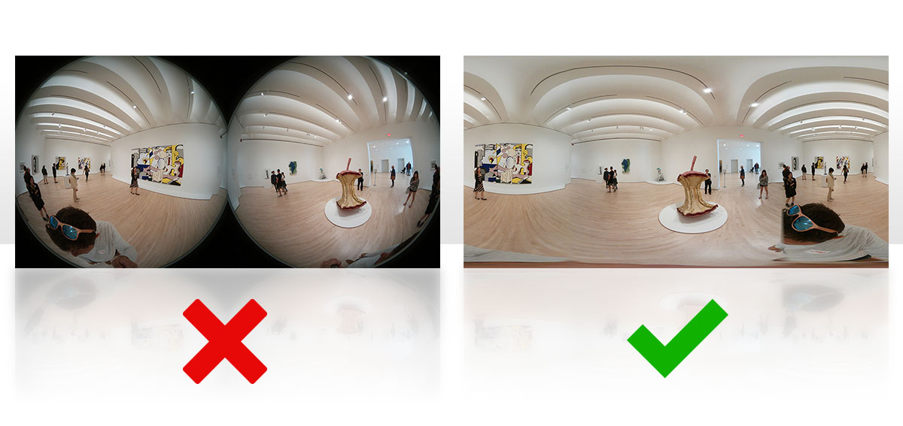

# E57 Format

## 🎯 Purpose of This Repository
This repository aims to provide a clear and straightforward guide for manufacturers on how to create E57 files that include mobile point clouds and 360° images. Unlike other resources, this guide focuses specifically on integrating both point cloud data and 360° images into a unified format, addressing the unique challenges of mobile scanning while ensuring compatibility with industry-leading platforms like Autodesk ReCap 2025 and ATIS.cloud. By following the instructions here, developers can ensure their scanners are fully compatible with both Autodesk ReCap 2025 and ATIS.cloud, enabling a unified and seamless user experience.

## 📝 About
The mobile scanner market has been growing rapidly since 2022, highlighting the need for clear standards to streamline workflows and improve user experiences. The structure of E57 files plays a critical role in achieving this simplicity: adhering to a standardized format ensures seamless integration between manufacturers, software platforms, and end users.</br>
As of February 2022, ATIS.cloud is fully compatible with mobile images embedded in unstructured E57 files, enabling smooth integration for manufacturers who follow the specifications detailed in this repository.</br>
Recognizing the importance of a unified approach, both ATIS.cloud and Autodesk ReCap 2025  support a standardized E57 file format. This shared adoption establishes a consistent standard, simplifying data processing for the industry and its clients. By adhering to these specifications, mobile scanner manufacturers can achieve full compatibility, ensuring optimal interoperability and effortless workflows across platforms.</br>

## 🤝 Compatibility with Autodesk ReCap 2025 and ATIS.cloud

### 🌀 Unstructured E57 Files (Including 360° Mobile Scanner Images)
Unstructured E57 files, including 360° images, offer a significant advantage by simplifying data sharing. By embedding both point clouds and images within a single E57 container, they eliminate the need to bundle separate JPEG files in a ZIP archive. This approach addresses challenges such as irregular movement patterns and varying environmental conditions during data capture, making it especially advantageous for mobile systems operating in dynamic or complex environments. In such cases, images are stored as 2D representations. These images are encapsulated in a heterogeneous vector of Image2D structures to store data from cameras or similar devices.

### Integration Requirements
To ensure compatibility, the following specifications are mandatory:

1. **Spherical Representation:**
     - Images must use a spherical representation.

2. **Image Metadata: each image must include**
     - A **position** (translation vector).
     - A **rotation quaternion**.

3. **Sensor Information:**
     - Add an element named `sensorVendor` to the `vectorChild` of each image.
     - This field should be filled with the name of the scanner or processing software.

4. **Projection Requirements:**
     - Images must be in an equirectangular projection covering 100% of the field of view (360° horizontally and vertically).
     - Example of the required format: .

### ⚠️ Mandatory Compliance
All the above requirements are **mandatory**. Integration will not be possible if any of these criteria are unmet.

### Example XML Structure for E57 Files
Below is an example of how the `vectorChild` for an image should be structured in the XML section of the E57 file:

**guid**         : A unique identifier for the image.</br>
**name**         : The name assigned to the image for reference.</br>
**description**  : A brief description of the image.</br>
**sensorVendor** : Specifies the scanner or software that generated the image.</br>
**pose**:

* **rotation**: Contains the quaternion values (w, x, y, z) to describe the image's orientation.
* **translation**: Specifies the position of the image in 3D space (x, y, z).

**sphericalRepresentation** :

* **jpegImage**: Points to the image data.
* **imageHeight** and **imageWidth**: Define the dimensions of the image.
* **pixelHeight** and **pixelWidth**: Specify the size of each pixel in the image.

```xml
<vectorChild type="Structure">
  <guid type="String"><![CDATA[{B6814439-9A66-4B78-A508-EC888E9387A7}]]></guid>
  <name type="String"><![CDATA[Image]]></name>
  <description type="String"><![CDATA[My Awesome Image]]></description>
  <sensorVendor type="String"><![CDATA[Your scanner/software name]]></sensorVendor>
  <pose type="Structure">
    <rotation type="Structure">
      <w type="Float">5.72200246355708098e-01</w>
      <x type="Float">-1.57413981933175670e-02</x>
      <y type="Float">-3.43825646644880592e-02</y>
      <z type="Float">8.19241677223808695e-01</z>
    </rotation>
    <translation type="Structure">
      <x type="Float">-5.19676770732874793e+00</x>
      <y type="Float">9.10547896196429285e+00</y>
      <z type="Float">1.12128809534611884e+00</z>
    </translation>
  </pose>
  <sphericalRepresentation type="Structure">
    <jpegImage type="Blob" fileOffset="8316894432" length="20622113"/>
    <imageHeight type="Integer">4096</imageHeight>
    <imageWidth type="Integer">8192</imageWidth>
    <pixelHeight type="Float">5.00000000000000041e-06</pixelHeight>
    <pixelWidth type="Float">5.00000000000000041e-06</pixelWidth>
  </sphericalRepresentation>
</vectorChild>
```

### Note:
1. **Independent Processing:**
   - There is no direct relationship between the point cloud and the images via a GUID. These elements are processed independently. You can include either a single scan (point cloud) or multiple images in your E57 file as needed.

2. **GUID Association:**
   - Do not add the `associatedData3DGuid` element (which specifies the scan for each image) to the child vector of images.

## 📚 Additional Resources
To learn more about the E57 format, refer to the following resources:

- [Official E57 Documentation (ASTM7Cen-US.pdf)](assets/docs/ASTM7Cen-US.pdf)
- [E57 Format Website](http://www.libe57.org/index.html)
- [Sample Data Repository](http://www.libe57.org/data.html)
- [C++ Library Without Boost](https://github.com/asmaloney/libE57Format)

## 📂 Code and Examples
In the `code` directory, you will find sample scripts that demonstrate how to create E57 files meeting the integration requirements of Autodesk ReCap 2025 and ATIS.cloud.

Examples include:

* Saving images in spherical representation. 
* Saving point clouds and images in E57 format.

Explore the examples:

- [C++ Examples](code/C++/)
- [Python Examples](code/python/)

Check out the [samples](samples) directory for reference files.

## 🤝 Contributing
Contributions are welcome! Follow these steps to contribute:
1. Fork the repository.
2. Create a feature branch.
3. Submit a pull request with your changes.

## 📝 License
This project is licensed under the MIT License. See the LICENSE file for details.